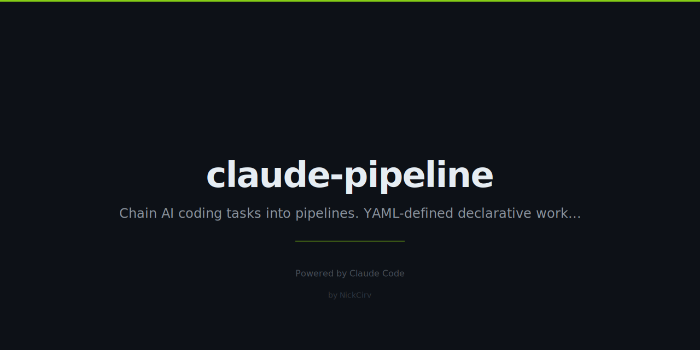

# claude-pipeline

Chain Claude Code tasks into YAML-defined pipelines. Like GitHub Actions, but Claude is every step.



## Install

```bash
npm install -g claude-pipeline
# or use without installing:
npx claude-pipeline run pipeline.yml
```

## Quick Start

```bash
# Create a sample pipeline in the current directory
npx claude-pipeline init

# Run it
npx claude-pipeline run pipeline.yml

# Validate syntax without running
npx claude-pipeline validate pipeline.yml

# List all pipelines in the project
npx claude-pipeline list
```

## Pipeline Format

```yaml
name: ci-fix
steps:
  - name: lint
    task: "Run ESLint on the project, fix auto-fixable issues"
    on_fail: stop

  - name: test
    task: "Run the test suite"
    on_fail: continue

  - name: fix-tests
    task: "Fix any failing tests from the previous step"
    depends_on: test
    condition: failed

  - name: commit
    task: "Commit all changes with a descriptive message"
```

## Step Options

| Field | Type | Default | Description |
|-------|------|---------|-------------|
| `name` | string | required | Unique step identifier |
| `task` | string | required | Natural language instruction sent to Claude |
| `on_fail` | `stop` \| `continue` | `stop` | What to do when this step fails |
| `depends_on` | string \| string[] | — | Run this step only after the named step(s) |
| `condition` | `always` \| `failed` \| `passed` \| `any` | `always` | When to run this step relative to its dependency |
| `retry` | 1–5 | 1 | Number of attempts before marking as failed |

## Context Chaining

Each step receives the output of all previous steps as context. This lets later steps build on earlier ones — e.g. a `fix-tests` step automatically knows which tests failed.

## Templates

Three ready-made templates are included in `templates/`:

| Template | Purpose |
|----------|---------|
| `ci-fix.yml` | Lint → type-check → fix types → test → fix tests → commit |
| `pr-ready.yml` | Full pre-PR checklist: lint, test, security, coverage, docs, PR description |
| `security-scan.yml` | Dependency audit → secrets scan → OWASP check → security report |

Copy any template to your project:

```bash
cp node_modules/claude-pipeline/templates/ci-fix.yml ./pipeline.yml
```

## CLI Reference

```
claude-pipeline run <file>      Execute a pipeline
  --dry-run                     Print steps without executing
  --verbose                     Show step output previews
  --json                        Output full result as JSON

claude-pipeline init [name]     Create a sample pipeline.yml
claude-pipeline validate <file> Check pipeline syntax
claude-pipeline list            Show available pipelines
```

## Requirements

- Node.js 18+
- `claude` CLI installed and authenticated (`npm install -g @anthropic-ai/claude-code`)

## License

MIT
